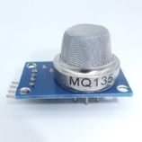
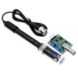
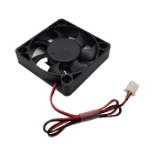
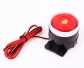
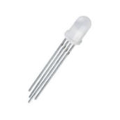

# MOE Air Quality
### 1\. Nombre del Proyecto
**MOE Air Quality**
### 2\. Visión
Con "MOE Air Quality", estamos comprometidos a proteger la salud y el bienestar de las familias, asegurando que cada hogar pueda disfrutar de un aire limpio y saludable. Nuestro enfoque integral combina tecnología avanzada, información accesible y educación, construyendo un futuro más seguro y sostenible para todos.
### 3\. Software Empleado
  - **Nombre:** Wokwi
    - **Licencia:** Open Source
  - **Nombre:** Visual Studio Code
    - **Licencia:** Open Source
  - **Nombre:** NodeRed
    - **Licencia:** Open Source
  - **Librerias**
      - machine
        - Pin
        - ADC
        - SoftI2C  
      - time
        - sleep     
      - umqtt.simple
        - MQTTClient   
      - network
      - ssd1306
        - SSD1306_I2C 
### 4\. Hardware Empleado
|**Sensores**|**Imagen**|**Descripción**|**Cantidad**|**Precio**|
| :-: | :-: | :-: | :-: | :-: |
|*MQ-135*||Ayuda a medir el nivel de calidad del aire|1|100\.00|
|*MQ-7*||Mide los niveles de CO2 en el aire|1|25\.00|
|*Módulo de Sensor regulador de detección de valor de PH liquido*||Mide el PH del agua en una determinada altura|1|62\.00|

|**Actuadores**|**Imagen**|**Descripción**|**Cantidad**|**Precio**|
| :-: | :-: | :-: | :-: | :-: |
|*Ventilador de refrigeración*||Ventila y refrigera dispositivos o áreas en un determinado rango|1|200\.00|
|*Sirena*||Se hace sonar en caso de algo que no funcione correctamente a modo de advertencia.|1|150\.00|
|*LED RGB*||Permite proyectar diferentes códigos de colores según se programe.|1|100\.00|
|*OLED*|| Pequeña pantalla de alta calidad utilizada comúnmente en proyectos de electrónica y microcontroladores. Estas pantallas se integran fácilmente con la ESP32 y son populares en el desarrollo de proyectos de IoT, wearables, y otros dispositivos compactos. |1|90\.00|

### 5\. Historias de Usuario Épicas
- **Cristian Emmanuel Gutiérrez Díaz:** Gestión de dióxido de carbono en el aire.

  - **ID:** H-1

    **Historia:** Como una madre de casa quiero mantener mi casa con un ambiente seguro para mi familia. Quiero poder monitorear la calidad del aire de mi casa en mi teléfono o algún dispositivo especializado. Debe incluir gráficas, alertas, información relevante niveles de aire. En el Sprint número: 3 sprint.
- **Nayeli Moya Díaz:** Desarrollo de web para datos reales.
  - **ID:** H-2

    **Historia:** Como una persona que usa mucho el teléfono quiero poder monitorear el aire de mi casa en mi dispositivo. Quiero poder monitorear la calidad del aire de mi casa en mi teléfono o algún dispositivo especializado. Debe incluir un dominio seguro, información del sistema, alertas, experiencia de usuario. En el Sprint número: 2 sprint.
- **Oscar Iván Pérez Mejía:** Monitoreo de la calidad del aire en tiempo real.
  - **ID:** H-3

    **Historia:** Como una abuela quiero saber si en mi casa hay algún gas o sustancia gaseosa nociva para mi salud. Quiero poder escuchar en caso de mala calidad de aire en mi ambiente o en caso de gases nocivos para la salud. Debe detectar gases nocivos, diferenciar tipos de gas (posible). En el Sprint número: 2 sprint.
### 6\. Fotografía del Prototipo

- **Descripción del Prototipo:** Prototipo de dispositivo wearable con pantalla LED para mostrar la calidad del aire, equipado con sensores de gas y conectividad Wi-Fi para sincronización con aplicaciones móviles.
### 7\. Arquitectura del Proyecto
- **Sensores:**
  - MQ-135 (Calidad del aire)
  - MQ-7 (Niveles de CO2)
  - Módulo PH (Medir PH del agua)
- **Actuadores:**
  - Alarma sonora para alertas de gases nocivos
  - LED RGB (Colores de notificación)
  - Ventilador (Ventila áreas o dispositivos)
  - LGVL (Permite la interacción con el usuario)
- **Controladores:**
  - ESP32
- **Plataforma de Base de Datos:**
  - MongoDB
- **Protocolo de Comunicación:**
  - MQTT para transmisión de datos entre sensores y servidor
- **Gestión de Energía:**
  - Puerto de carga
- **Dispositivos Receptores y/o Transmisores:**
  - Teléfonos móviles
  - Tabletas
  - Laptops
### 8\. Captura de Pantalla del Tablero Kanban

- **Sprint 1:**

   Para el primer sprint de 4 semanas tenemos el avance e funcionalidad para los sensores MQ-7 y MQ-135 en donde se da la información de la calidad del aire para el caso del 135 y los niveles de dióxido de carbono para el 7 con la ayuda de buzzer y LEDS para verificar que los niveles esten correctos o alerten en caso de algún resultado peligroso para el usuario y este sea avisado para tomar medidas necesarias. Se realizó el primer template del dashboard en el cual se manejan los datos actuales e historicos de ambos sensores para mantener en constante informe al usuario final. Además se ha realizado un diseño prototipo que funciona para dar idea del diseño final aunque este puede variar al final de acuerdo al avance del proyecto.  
- **Sprint 2:** 
- **Sprint 3:** 
### 9\. Circuito Diseñado para el Proyecto Completo

  **Descripción del Circuito:** Circuito que incluye el ESP32, sensores MQ-135, MQ-7, PH, y conexiones a una alarma sonora y una pantalla LED para visualización de datos.
### 10\. Resultados
- **Sprint 1 Resultado:** 

  **Descripción:** Integración inicial del sensor MQ-135 y MQ-7 con el ESP32 y Buzzer, datos enviados a NodeRed para dashboard con datos historicos y actuales.
- **Sprint 2 Resultado:**
  
- **Sprint 3 Resultado:** 
 
