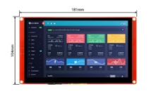

# MOE Air Quality
### 1\. Nombre del Proyecto
**MOE Air Quality**
### 2\. Enunciado de Visión
Con "MOE Air Quality", estamos comprometidos a proteger la salud y el bienestar de las familias, asegurando que cada hogar pueda disfrutar de un aire limpio y saludable. Nuestro enfoque integral combina tecnología avanzada, información accesible y educación, construyendo un futuro más seguro y sostenible para todos.
### 3\. Software Empleado
  - **Nombre:** Wokwi
  -- **Licencia:** Open Source
  - **Nombre:** Visual Studio Code
  -- **Licencia:** Open Source
  - **Nombre:** NodeRed
  -- **Licencia:** Open Source
### 4\. Hardware Empleado
|**Sensores**|**Imagen**|**Descripción**|**Cantidad**|**Precio**|
| :-: | :-: | :-: | :-: | :-: |
|*MQ-135*||Ayuda a medir el nivel de calidad del aire|1|100\.00|
|*MQ-7*||Mide los niveles de CO2 en el aire|1|25\.00|
|*Módulo de Sensor regulador de detección de valor de PH liquido*||Mide el PH del agua en una determinada altura|1|62\.00|

|**Actuadores**|**Imagen**|**Descripción**|**Cantidad**|**Precio**|
| :-: | :-: | :-: | :-: | :-: |
|*Ventilador de refrigeración*||Ventila y refrigera dispositivos o áreas en un determinado rango|1|200\.00|
|*Sirena*||Se hace sonar en caso de algo que no funcione correctamente a modo de advertencia.|1|150\.00|
|*LED RGB*||Permite proyectar diferentes códigos de colores según se programe.|1|100\.00|
|*LGVL*||Permite una interacción vía táctil entre el dispositivo para actuadores y sensores.|1|500\.00|

### 5\. Historias de Usuario Épicas
- **Cristian Emmanuel Gutiérrez Díaz:** Gestión de dióxido de carbono en el aire.

  - **ID:** H-1
  - **Historia:** Como una madre de casa quiero mantener mi casa con un ambiente seguro para mi familia. Quiero poder monitorear la calidad del aire de mi casa en mi teléfono o algún dispositivo especializado. Debe incluir gráficas, alertas, información relevante niveles de aire. En el Sprint número: 3 sprint.
- **Nayeli Moya Díaz:** Desarrollo de web para datos reales.
  - **ID:** H-3
  - **Historia:** Como una persona que usa mucho el teléfono quiero poder monitorear el aire de mi casa en mi dispositivo. Quiero poder monitorear la calidad del aire de mi casa en mi teléfono o algún dispositivo especializado. Debe incluir un dominio seguro, información del sistema, alertas, experiencia de usuario. En el Sprint número: 2 sprint.
- **Oscar Iván Pérez Mejía:** Monitoreo de la calidad del aire en tiempo real.
  - **ID:** H-4
  - **Historia:** Como una abuela quiero saber si en mi casa hay algún gas o sustancia gaseosa nociva para mi salud. Quiero poder escuchar en caso de mala calidad de aire en mi ambiente o en caso de gases nocivos para la salud. Debe detectar gases nocivos, diferenciar tipos de gas (posible). En el Sprint número: 2 sprint.
### 6\. Fotografía del Prototipo
(Nota: Puedes usar software de diseño como Figma, Sketch o incluso PowerPoint para crear el diseño profesional del prototipo.)

- **Descripción del Prototipo:** Prototipo de dispositivo wearable con pantalla LED para mostrar la calidad del aire, equipado con sensores de gas y conectividad Wi-Fi para sincronización con aplicaciones móviles.
### 7\. Arquitectura del Proyecto
- **Sensores:**
- MQ-135 (Calidad del aire)
- MQ-7 (Niveles de CO2)
- Módulo PH (Medir PH del agua)
- **Actuadores:**
- Alarma sonora para alertas de gases nocivos
- LED RGB (Colores de notificación)
- Ventilador (Ventila áreas o dispositivos)
- LGVL (Permite la interacción con el usuario)
- **Controladores:**
- ESP32
- **Plataforma de Base de Datos:**
- MongoDB
- **Protocolo de Comunicación:**
- MQTT para transmisión de datos entre sensores y servidor
- **Gestión de Energía:**
- Puerto de carga
- **Dispositivos Receptores y/o Transmisores:**
- Teléfonos móviles
- Tabletas
- Laptops
### 8\. Captura de Pantalla del Tablero Kanban
![Captura de pantalla de computadora

Descripción generada automáticamente]

- **Sprint 1:**
- 
- **Sprint 2:** 
- **Sprint 3:** 
### 9\. Circuito Diseñado para el Proyecto Completo
(Nota: Usa software como Fritzing para diseñar el circuito.)

- **Descripción del Circuito:** Circuito que incluye el ESP32, sensores MQ-135, y conexiones a una alarma sonora y una pantalla LED para visualización de datos.
### 10\. Resultados
- **Sprint 1 Resultado:** 
  - **Descripción:** Integración inicial del sensor MQ-135 con el ESP32, datos enviados a ThingSpeak.
- **Sprint 2 Resultado:** 
  - **Descripción:** Desarrollo de la web con visualización en tiempo real y alertas implementadas.
- **Sprint 3 Resultado:** 
  - **Descripción:** Visualización histórica de datos y pruebas comparativas de calidad del aire realizadas exitosamente.

